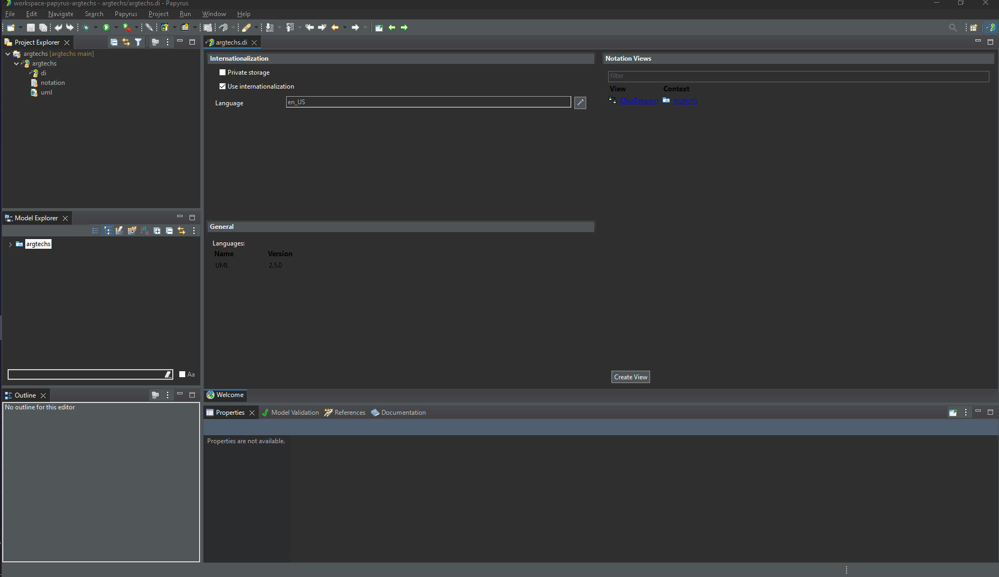

# argtechs

- lataa papyrus
- git clone tämä repo

- avaa papyrus, ja valitse workspaceksi workspace-papyrus-argtechs
- valitse ylävalikosta File - Open Projects from File System...
- valitse Import source> -kohtaan ...argtechs/workspace-papyrus-argtechs/argtechs
- paina Finish

- nyt Project Explorer -näkymässä pitäisi näkyä argtechs

- avaa eka taso ja tuplaklikkaa sen alla olevaa argtechs-elementtiä
- oikeassa ylälaidassa pitäisi nyt näkyä Notation Views-näkymä:

- tämän alla olevista linkeistä klikkaamalla saa auki esim. projektin sisältämät diagrammit

- profit?